::::::::::::::::::::::::::::::::::::::: objectives

- Go through the modify-add-commit cycle for one or more files.
- Explain where information is stored at each stage of that cycle.
- Distinguish between descriptive and non-descriptive commit messages.

::::::::::::::::::::::::::::::::::::::::::::::::::

:::::::::::::::::::::::::::::::::::::::: questions

- How do I record changes in Git?
- How do I check the status of my version control repository?
- How do I record notes about what changes I made and why?

::::::::::::::::::::::::::::::::::::::::::::::::::

# Create text file
First let's make sure we're still in the right directory.
You should be in the `recipes` directory.


Let's create a file called `guacamole.md` that contains the basic structure to
have a recipe. 

<hr >

**Option 1 Windows Explorer**. You can do this in Windows explorer, menu `New` and then `New Text Document`:


Alternatively, context menu is available by right-clicking in the explorer for the pop-up menu and choose `New Text Document`:


Name the text document `guacamole.md`. Check that the file extension is `md`.

<hr >

**Option 2 Visual Studio Code File menu** VS Code also has file management options. First, ensure that you are in Explorer view. If not, please click top menu `View` and then `Explorer`:


Then, click top menu `File` followed by `New File`, and you are asked for the file name:


Name the text document `guacamole.md` - check that the file extension is `md` - and press return.

<hr >

**Option 3 VS Code Explorer New File** Another option to create files is to use the new file icon in Exlorer:


<hr >

The new file is listed in the Primary Side Bar (left). Whether you created the file in VS Code or Windows Explorer, you can use either to edit the file. VS Code has the new file opened for editing when it is created. File edited in VS Code and be further edited in a Windows text editor, and vice versa.

**Text editor in MS WIndows.**
If you prefer to edit the file in Windows Explorer, you will use your text editor of choice. Please ensure the editor saves in text format only: Windows `Notepad` is a good choice, but not `Write`. Other options include `Notepad++` and `Sublime Text`. To check an editor works as required, save the file, then open it in VS Code.

VS Code keeps track of changes in your repository, it tells us that it's noticed the new file.  
Here, the new file has a "U" on its right: both in the Primary Side Bar, and in the file tab. "U" indicates that VS Code is not keeping track of this file. We want to have VS Code to track this file for changes: we will do that later.


# Edit text file
Type the text below into the `guacamole.md` file. Please take note that the text begins on the first line, with no space on the left, and each line begins with one or two '#' exactly as shown:

```
# Guacamole
## Ingredients
## Instructions
```


With the file opened in VS Code, take note of the file tab: when a file has changes that have not been saved, the right side icon is a dark circle (&#x25CF;). When the file is saved, the icon becomes an `X` (**&#10005;**). Whether a dark circle or an `X`, clicking on it closes that window, and you are asked if you want to save it if it has changes.

The file status is also shown in the Primary Side Bar, when hovering over it, or having it selected:

&nbsp;&nbsp;&nbsp;


We will now save the file (menu `File` - `Save`). The file tab indicator changes from the dark circle to `X`.

# Creating first version of the file
To manage file versions, we switch over to source control view. As a reminder, here is how to go to  source control view:

If VS Code top menu is visible, use `View` and `Source Control`. If the top menu is not available (because VS Code window is narrow), the menu is available from the menu shortcut on the left.

&nbsp;&nbsp;&nbsp;


For clarity, please display all available source control functions from the Source Control sub-menu:


The source control view should look similar to this:


In the above source control view, VS Code tells us that it's noticed one new file indicated with `1` and the `U`. Further, it tells us this is in repository branch "main".

We can tell Git to track this file by clicking the '**&#043;**' icon, for **staging** the file. Note that in this case we have only one file to track, we can either click the '**&#043;**' of the file, or the '**&#043;**' (second screenshot) which is for the whole set of file (where only file is available and to add to tracking). This process is called "staging" because it is the holding area before fully commiting this version.


VS Code will carry out some steps to add the file. After a few seconds, it will show completion of the "staging" stage:


Here, take note that there are '0' changes between the staging area and the working directory. Secondly, the file is added ('A') to staging. Staged Changes shows '1' to tell us that VS Code know there is one file being different between content of Staging and commit history.

Git now knows that it's supposed to keep track of `guacamole.md`,
but it hasn't recorded these changes as a commit yet. Before we run commit, there are a few helping things VS Code shows us. In VS Code's Explorer view, the file is shown as added to staging ('A'):


Back in VS Code's Source Control view, under `Staged Changes`, we can click the file to show `Changes`. Here the left icon (with a "+" and "-" symbol) is to view changes between the version of the file in the repository and that in the Staging area. Clicking on that icon will show a pop-up message at the bottom of the screen.


The pop-up message might be similar to this:


Clicking the second left icon (the round arrow going to the left) will discard the changes, i.e. remove the Staging.

The next icon, '**&#043;**', is for staging changes. Since there is no change (shown with the '0'), clicking on '**&#043;**' does not do anything. See below for the icons.


We see in the above image that on the right of "Staged Changes" is shown a "1". This means Git knows there is one item changed between the file version in the Staging area, and in Commit. Click in the first icon ("+" and "-" symbol), VS Code will show the differences in file content between the two versions:


To commit what is in the Staging area, we click the button "Commit".

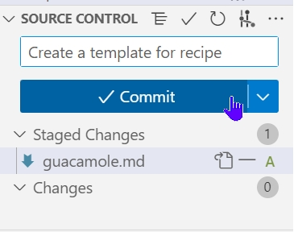


VS Code then opens a new tab (named "COMMIT_EDITMSG") and waits for us to enter the corresponding commit message. Enter in line 1:

`Create a template for recipe`

As shown in the following image, there is an undo icon (the one with the round arrow pointing to the left) and a tick icon. The lines below, each beginning with "#" have further instructions, and can be left as they are. To commit with this message, click on the tick icon, and a confirmation dialog appears. Here click `Save`.

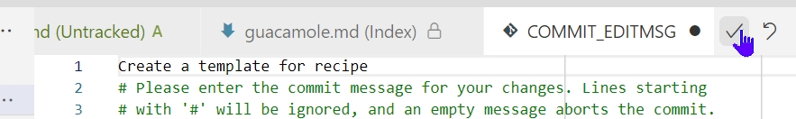

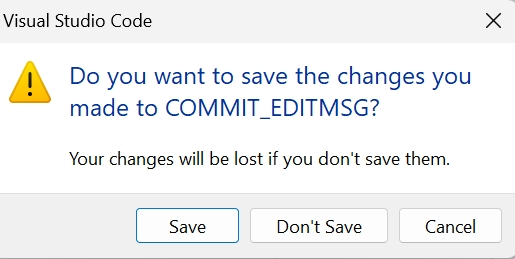

The Source Control might show progress bar for a few seconds. And then the blue button, which showed "Commit" before, now shows "Publish Branch". Further under "Source Control Graph" is the first listing of our commit which is for the branch `main`.

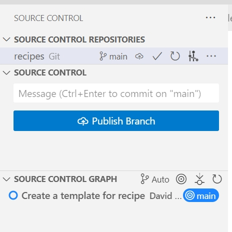

Click on the `main` link in Source Control Graph will show a summary of this commit. When we run `Commit`,
Git takes everything we have told it to save 
and stores a copy permanently inside the special `.git` directory.
This permanent copy is called a [commit](../learners/reference.md#commit)
(or [revision](../learners/reference.md#revision)) and its short identifier is `eb8fac66`. Your commit may have another identifier.

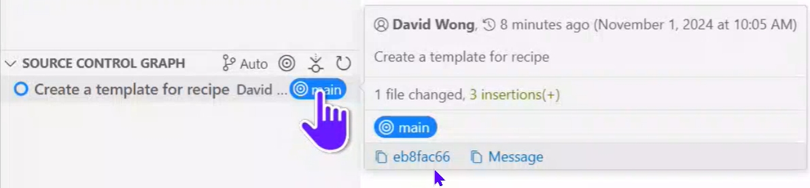

[Good commit messages][commit-messages] start with a brief (\<50 characters) statement about the
changes made in the commit. Generally, the message should complete the sentence "If applied, this commit will" <commit message here>.
If you want to go into more detail, add a blank line between the summary line and your additional notes. Use this additional space to explain why you made changes and/or what their impact will be.

Another useful feature in VS Code is that it tells us everything is up to date: the tick icon next to `Source Control Repositories` and `Source Control`.

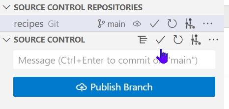

If we want to know what we've done recently,
we can ask Git to show us the project's history using the Git Graph icon: either the one under `Source Control Repositories` or `Source Control`:

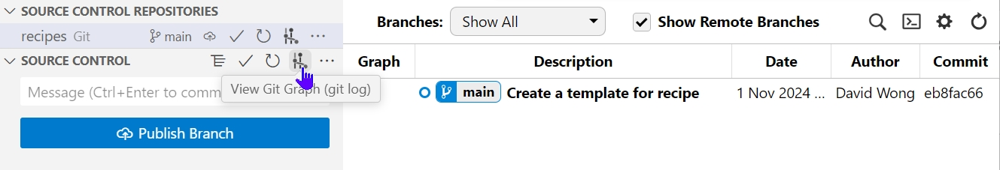

We can view details of this commit by clicking on the commit item. Git Graph lists all commits made to a repository in reverse chronological order.
The listing for each commit includes
the commit's full ID
(which starts with the same characters as
the short ID),
the commit's author,
when it was created,
and the commit message Git was given when the commit was created.

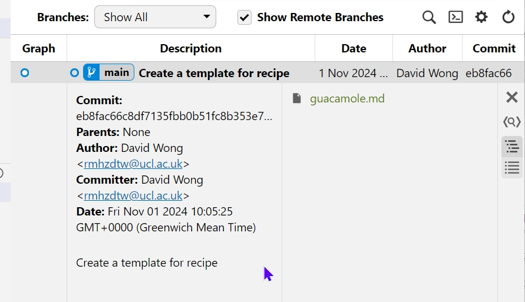


:::::::::::::::::::::::::::::::::::::::::  callout

## Where Are My Changes?

If we look at the contents of our `recipes` folder, we will still see just one file called `guacamole.md`.
That's because Git saves information about files' history
in the special `.git` directory mentioned earlier
so that our filesystem doesn't become cluttered
(and so that we can't accidentally edit or delete an old version).

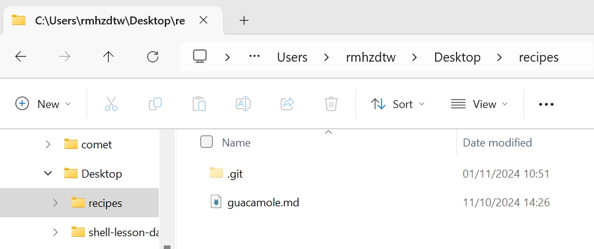

::::::::::::::::::::::::::::::::::::::::::::::::::

Now suppose Alfredo adds more information to the file as shown below. You can copy and paste either all the five lines, or the three lines of ingredients, into your VS Code editor. 

```output
# Guacamole
## Ingredients
* avocado
* lemon
* salt
## Instructions
```

In the editor, the added lines are indicated with a solid green line on their left.

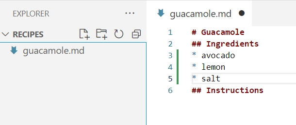

**Important**. Save the file (`File` - `Save`). The file tab shows the file is modified ('M'). In the Explorer file list, this file is indicated with an 'M'.

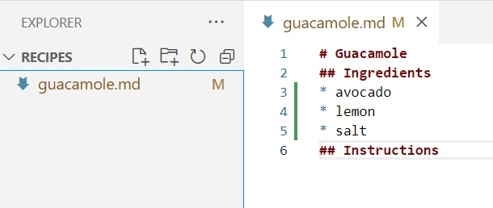

Go to `Source Control`, Git tells us that a file it already knows about has been modified, indicated by the 'M' in the `Source Control` - `Changes` list (bottom of the image). Clicking on this 'M' opens a `Working Tree` tab that shows what the changes are, in this case, the new lines are highlighted with a green background.

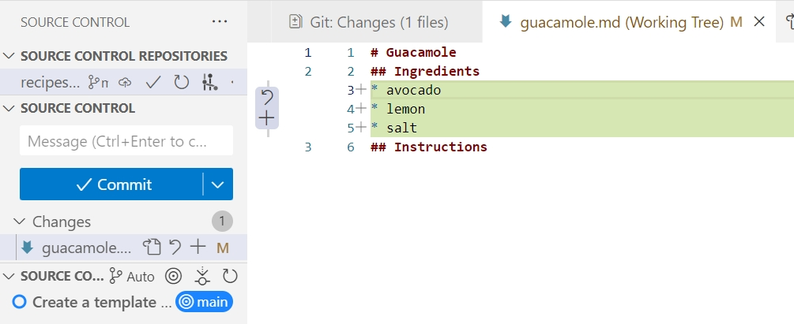

Also, clicking on the '+' '-' icon (as shown below), will show `Git Changes` (see tab in the image above). There is no difference between this (`Git Changes`) and the `Working Tree` above.

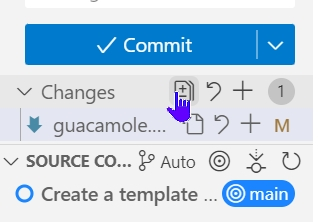

Of the lines in green background, note that there is also a `+` on the left of each line. Each shows where we added a line.

Git Graph tells us there are uncommitted changes (one) between our repository and the staging area, when the changes were made, and the number of added lines (shown by '+3') and deleted ones (in this case '-0').

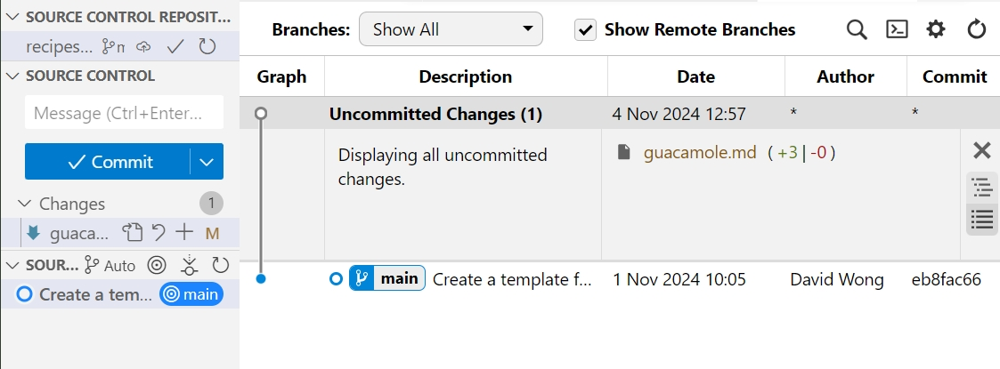

After reviewing our change, it's time to commit it. Click the commit button. Whoops:
Git won't commit because we didn't add files to the staging area.

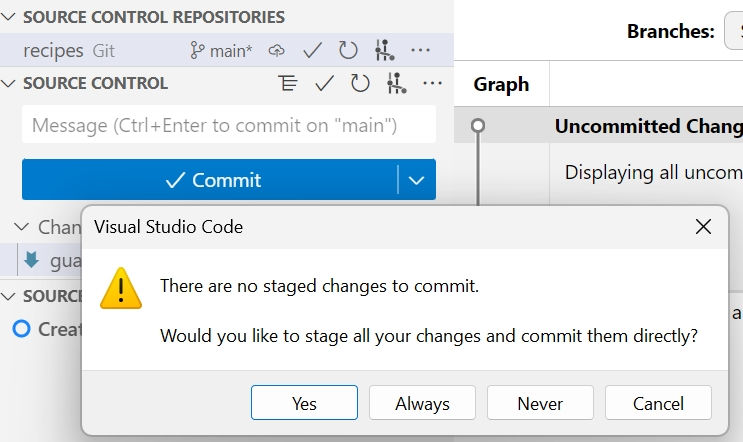

Let's fix that. Click `Cancel` on the dialog box, and click "+" next to file `guacamole.md` to add this file to the staging area. (As above, another option is to use the "+" icon next to `Changes`, a line above the file: this icon will appear along with the digit "1".)


Having done that, Source Control now shows `Staged Changes` and with a  digit "1", which indicates the number of changes (files), see image below. Further, the `Changes` menu that was shown before the staging is repeated after the staging, the differences being the digit of "0" says there is no change between the version in staging, and the working directory; secondly, there is no file listed under `Changes` (file `guacamole.md` is now listed in `Staged Changes`.)

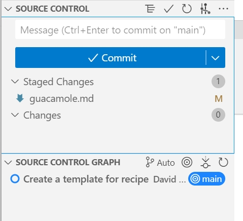

Enter commit message "Add basic guacamole's ingredients" and click the tick icon as shown.

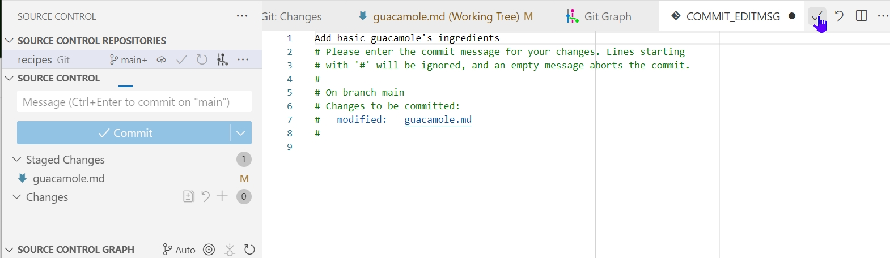

A confirmation dialog box appears, click `Save`.

In Source Control Graph / Git Graph, click on the commit message to show its description. The file `guacamelo.md` is the changed file in this commit, and there were 3 insertions (3 lines), indicated by the digit "+3", and no deletions ("-0"). For reference the commit ID is shown, also the person who made the commit and the date and time this was made.

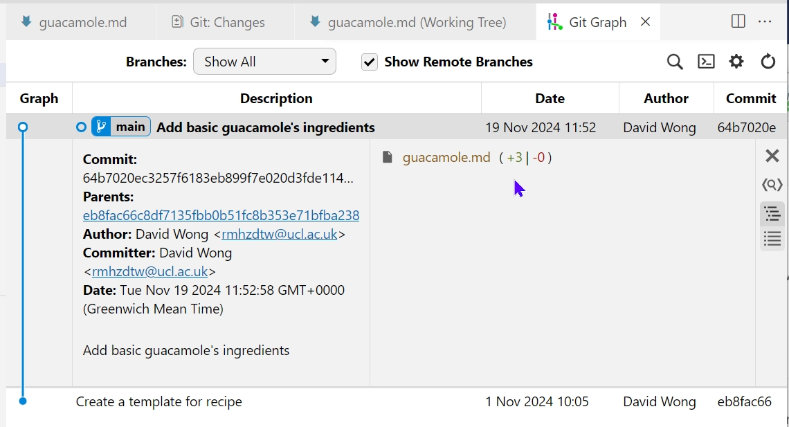

Git insists that we add files to the set we want to commit
before actually committing anything. This allows us to commit our
changes in stages and capture changes in logical portions rather than
only large batches.
For example,
suppose we're adding a few citations to relevant research to our thesis.
We might want to commit those additions,
and the corresponding bibliography entries,
but *not* commit some of our work drafting the conclusion
(which we haven't finished yet).

To allow for this,
Git has a special *staging area*
where it keeps track of things that have been added to
the current [changeset](../learners/reference.md#changeset)
but not yet committed.

:::::::::::::::::::::::::::::::::::::::::  callout

## Staging Area

If you think of Git as taking snapshots of changes over the life of a project,
using `Changes` "+" specifies *what* will go in a snapshot
(putting things in the staging area),
and the `Commit` button then *actually takes* the snapshot, and
makes a permanent record of it (as a commit).
If you don't have anything staged when you want to commit,
Git will prompt you to add files
which is kind of like gathering *everyone* to take a group photo!
However, it's almost always better to
explicitly add things to the staging area, because you might
commit changes you forgot you made. (Going back to the group photo simile,
you might get an extra with incomplete makeup walking on
the stage for the picture because you used `-a`!)
Try to stage things manually,
or you might find yourself searching for "undo commit" more
than you would like!

::::::::::::::::::::::::::::::::::::::::::::::::::

{alt='A diagram showing how "git add" registers changes in the staging area, while "git commit" moves changes from the staging area to the repository'}

Let's watch as our changes to a file move from our editor
to the staging area
and into long-term storage.
First,
we'll improve our recipe by changing 'lemon' to 'lime':

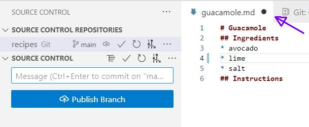

Note that the icon on the file tab shows a dark dark circle (&#x25CF;) indicating the file is changed and not saved, and the blue vertical line indicates where the change line is ("* lime"). When the file is saved, the icon becomes an `X` (**&#10005;**). 

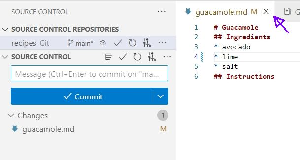

In `Source Control`, we see there is "1" change, and one file is indicated with an "M" for modified. This change compares content of the working directory and of commits.

With the file saved, we can use `Changes` "+" "-" icon to show the changed lines.

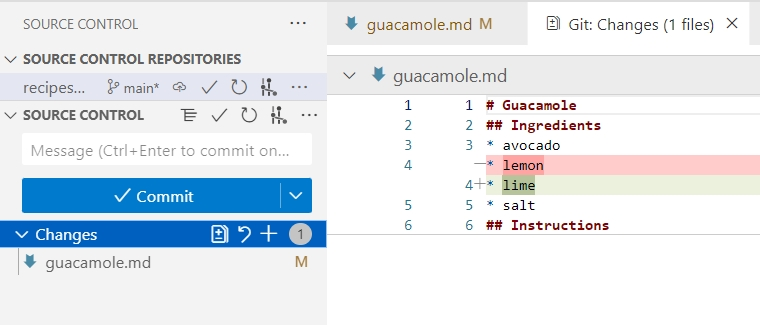

So far, so good:
we've replaced one line (shown with a `-` in the first column) with a new line
(shown with a `+` in the first column).
Now let's put that change in the staging area
and see what changes VS Code reports.

To add this file to the staging area, click the "+" icon next to the file. Remember that clicking the "+" icon next to `Changes` will do the same thing in this instance.

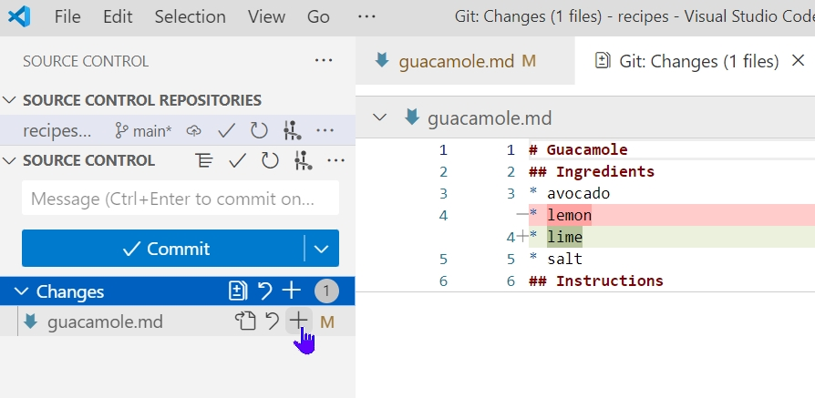

Git now proceeds to the next step that shows `Staged Changes`, with "1" change, and that change is for the file `guacamole.md` (also indicated with the "M"). In menu `Changes`, number of changes is "0". After saving the file, VS Code will show the "Git: Changes" window, which tells us "No Changed Files". This is correct, as far as Git can tell, there's no difference between what it's been asked to save permanently and what's currently in the directory.

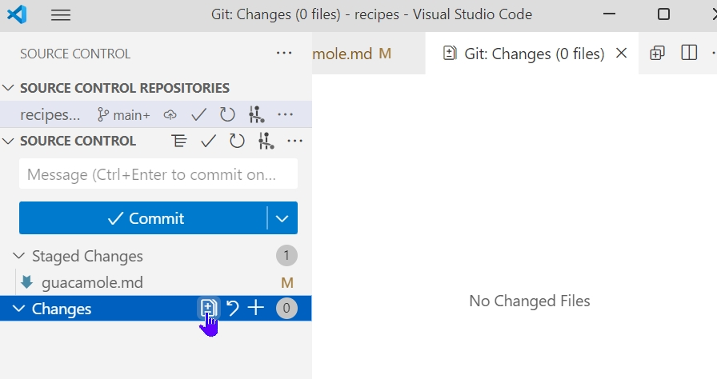

To compare content of the staging area and commit, we click on the "+" next to `Staged Changes`. It shows us the difference between
the last committed change
and what's in the staging area.

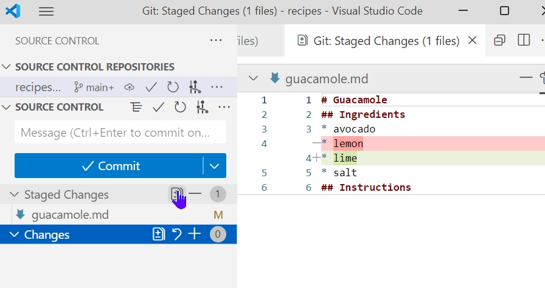


<hr />
<hr />
<hr />


Let's save our changes:

```bash
$ git commit -m "Modify guacamole to the traditional recipe"
```

```output
[main 005937f] Modify guacamole to the traditional recipe
 1 file changed, 1 insertion(+)
```

check our status:

```bash
$ git status
```

```output
On branch main
nothing to commit, working tree clean
```

and look at the history of what we've done so far:

```bash
$ git log
```

```output
commit 005937fbe2a98fb83f0ade869025dc2636b4dad5 (HEAD -> main)
Author: Alfredo Linguini <a.linguini@ratatouille.fr>
Date:   Thu Aug 22 10:14:07 2013 -0400

    Modify guacamole to the traditional recipe

commit 34961b159c27df3b475cfe4415d94a6d1fcd064d
Author: Alfredo Linguini <a.linguini@ratatouille.fr>
Date:   Thu Aug 22 10:07:21 2013 -0400

    Add basic guacamole's ingredients

commit f22b25e3233b4645dabd0d81e651fe074bd8e73b
Author: Alfredo Linguini <a.linguini@ratatouille.fr>
Date:   Thu Aug 22 09:51:46 2013 -0400

    Create a template for recipe
```

:::::::::::::::::::::::::::::::::::::::::  callout

## Word-based diffing

Sometimes, e.g. in the case of the text documents a line-wise
diff is too coarse. That is where the `--color-words` option of
`git diff` comes in very useful as it highlights the changed
words using colors.


::::::::::::::::::::::::::::::::::::::::::::::::::

:::::::::::::::::::::::::::::::::::::::::  callout

## Paging the Log

When the output of `git log` is too long to fit in your screen,
`git` uses a program to split it into pages of the size of your screen.
When this "pager" is called, you will notice that the last line in your
screen is a `:`, instead of your usual prompt.

- To get out of the pager, press <kbd>Q</kbd>.
- To move to the next page, press <kbd>Spacebar</kbd>.
- To search for `some_word` in all pages,
  press <kbd>/</kbd>
  and type `some_word`.
  Navigate through matches pressing <kbd>N</kbd>.
  

::::::::::::::::::::::::::::::::::::::::::::::::::

:::::::::::::::::::::::::::::::::::::::::  callout

## Limit Log Size

To avoid having `git log` cover your entire terminal screen, you can limit the
number of commits that Git lists by using `-N`, where `N` is the number of
commits that you want to view. For example, if you only want information from
the last commit you can use:

```bash
$ git log -1
```

```output
commit 005937fbe2a98fb83f0ade869025dc2636b4dad5 (HEAD -> main)
Author: Alfredo Linguini <a.linguini@ratatouille.fr>
Date:   Thu Aug 22 10:14:07 2013 -0400

   Modify guacamole to the traditional recipe
```

You can also reduce the quantity of information using the
`--oneline` option:

```bash
$ git log --oneline
```

```output
005937f (HEAD -> main) Modify guacamole to the traditional recipe
34961b1 Add basic guacamole's ingredients
f22b25e Create a template for recipe
```

You can also combine the `--oneline` option with others. One useful
combination adds `--graph` to display the commit history as a text-based
graph and to indicate which commits are associated with the
current `HEAD`, the current branch `main`, or
[other Git references][git-references]:

```bash
$ git log --oneline --graph
```

```output
* 005937f (HEAD -> main) Modify guacamole to the traditional recipe
* 34961b1 Add basic guacamole's ingredients
* f22b25e Create a template for recipe
```

::::::::::::::::::::::::::::::::::::::::::::::::::

:::::::::::::::::::::::::::::::::::::::::  callout

## Directories

Two important facts you should know about directories in Git.

1. Git does not track directories on their own, only files within them.
  Try it for yourself:
  
  ```bash
  $ mkdir cakes
  $ git status
  $ git add cakes
  $ git status
  ```
  
  Note, our newly created empty directory `cakes` does not appear in
  the list of untracked files even if we explicitly add it (*via* `git add`) to our
  repository. This is the reason why you will sometimes see `.gitkeep` files
  in otherwise empty directories. Unlike `.gitignore`, these files are not special
  and their sole purpose is to populate a directory so that Git adds it to
  the repository. In fact, you can name such files anything you like.

2. If you create a directory in your Git repository and populate it with files,
  you can add all files in the directory at once by:
  
  ```bash
  git add <directory-with-files>
  ```
  
  Try it for yourself:
  
  ```bash
  $ touch cakes/brownie cakes/lemon_drizzle
  $ git status
  $ git add cakes
  $ git status
  ```
  
  Before moving on, we will commit these changes.
  
  ```bash
  $ git commit -m "Add some initial cakes"
  ```

::::::::::::::::::::::::::::::::::::::::::::::::::

To recap, when we want to add changes to our repository,
we first need to add the changed files to the staging area
(`git add`) and then commit the staged changes to the
repository (`git commit`):

{alt='A diagram showing two documents being separately staged using git add, before being combined into one commit using git commit'}

:::::::::::::::::::::::::::::::::::::::  challenge

## Choosing a Commit Message

Which of the following commit messages would be most appropriate for the
last commit made to `guacamole.md`?

1. "Changes"
2. "Changed lemon for lime"
3. "Guacamole modified to the traditional recipe"

:::::::::::::::  solution

## Solution

Answer 1 is not descriptive enough, and the purpose of the commit is unclear;
and answer 2 is redundant to using "git diff" to see what changed in this commit;
but answer 3 is good: short, descriptive, and imperative.


:::::::::::::::::::::::::

::::::::::::::::::::::::::::::::::::::::::::::::::

:::::::::::::::::::::::::::::::::::::::  challenge

## Committing Changes to Git

Which command(s) below would save the changes of `myfile.txt`
to my local Git repository?

1. ```bash
   $ git commit -m "my recent changes"
   ```
2. ```bash
   $ git init myfile.txt
   $ git commit -m "my recent changes"
   ```
3. ```bash
   $ git add myfile.txt
   $ git commit -m "my recent changes"
   ```
4. ```bash
   $ git commit -m myfile.txt "my recent changes"
   ```

:::::::::::::::  solution

## Solution

1. Would only create a commit if files have already been staged.
2. Would try to create a new repository.
3. Is correct: first add the file to the staging area, then commit.
4. Would try to commit a file "my recent changes" with the message myfile.txt.
  
  

:::::::::::::::::::::::::

::::::::::::::::::::::::::::::::::::::::::::::::::

:::::::::::::::::::::::::::::::::::::::  challenge

## Committing Multiple Files

The staging area can hold changes from any number of files
that you want to commit as a single snapshot.

1. Add some text to `guacamole.md` noting the rough price of the
  ingredients.
2. Create a new file `groceries.md` with a list of products and
  their prices for different markets.
3. Add changes from both files to the staging area,
   and commit those changes.

:::::::::::::::  solution

## Solution

First we make our changes to the `guacamole.md` and `groceries.md` files:

```bash
$ nano guacamole.md
$ cat guacamole.md
```

```output
# Guacamole
## Ingredients
* avocado (1.35)
* lime (0.64)
* salt (2)
```

```bash
$ nano groceries.md
$ cat groceries.md
```

```output
# Market A
* avocado: 1.35 per unit.
* lime: 0.64 per unit
* salt: 2 per kg
```

Now you can add both files to the staging area. We can do that in one line:

```bash
$ git add guacamole.md groceries.md
```

Or with multiple commands:

```bash
$ git add guacamole.md
$ git add groceries.md
```

Now the files are ready to commit. You can check that using `git status`. If you are ready to commit use:

```bash
$ git commit -m "Write prices for ingredients and their source"
```

```output
[main cc127c2]
 Write prices for ingredients and their source
 2 files changed, 7 insertions(+)
 create mode 100644 groceries.md
```

:::::::::::::::::::::::::

::::::::::::::::::::::::::::::::::::::::::::::::::

:::::::::::::::::::::::::::::::::::::::  challenge

## `bio` Repository

- Create a new Git repository on your computer called `bio`.
- Write a three-line biography for yourself in a file called `me.txt`,
  commit your changes
- Modify one line, add a fourth line
- Display the differences
  between its updated state and its original state.

:::::::::::::::  solution

## Solution

If needed, move out of the `recipes` folder:

```bash
$ cd ..
```

Create a new folder called `bio` and 'move' into it:

```bash
$ mkdir bio
$ cd bio
```

Initialise git:

```bash
$ git init
```

Create your biography file `me.txt` using `nano` or another text editor.
Once in place, add and commit it to the repository:

```bash
$ git add me.txt
$ git commit -m "Add biography file"
```

Modify the file as described (modify one line, add a fourth line).
To display the differences
between its updated state and its original state, use `git diff`:

```bash
$ git diff me.txt
```

:::::::::::::::::::::::::

::::::::::::::::::::::::::::::::::::::::::::::::::


[commit-messages]: https://chris.beams.io/posts/git-commit/
[git-references]: https://git-scm.com/book/en/v2/Git-Internals-Git-References


:::::::::::::::::::::::::::::::::::::::: keypoints

- `git status` shows the status of a repository.
- Files can be stored in a project's working directory (which users see), the staging area (where the next commit is being built up) and the local repository (where commits are permanently recorded).
- `git add` puts files in the staging area.
- `git commit` saves the staged content as a new commit in the local repository.
- Write a commit message that accurately describes your changes.

::::::::::::::::::::::::::::::::::::::::::::::::::
